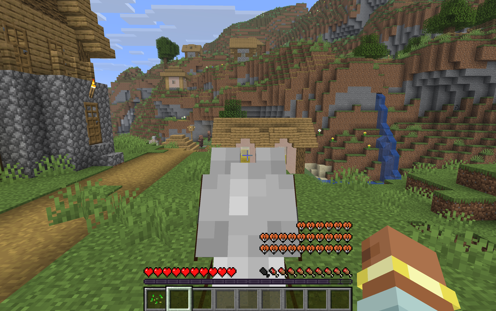

# Better Mount HUD (NeoForge)

Repositions the vanilla HUD while riding a mount so that mount health, the jump bar, and the experience level are all visible together.

A NeoForge port of [Better Mount HUD by Lortseam](https://modrinth.com/mod/better-mount-hud) (GPL-3.0), which only supports Fabric.

- **Target:** Minecraft 26.2 / NeoForge 26.2.0.88 / Java 25
- **Source:** https://github.com/mddarmawan/better-mount-hud-neoforge



## Build

Requires JDK 25 (NeoForge 26.x). Gradle can auto-provision it via the toolchain resolver.

```
./gradlew build
```

Jar output: `build/libs/bettermounthud-1.0.0.jar`.

## Test in the dev environment

```
./gradlew runClient
```

Gradle downloads Minecraft + NeoForge and launches the game with the mod loaded. Ride a horse, camel, or pig to see the HUD change.

## Install

1. Install NeoForge for Minecraft 26.2 (easiest via [Prism Launcher](https://prismlauncher.org/)).
2. Drop `bettermounthud-1.0.0.jar` into the instance's `mods/` folder.
3. Client-side only; do not install on a server.

## Layout

```
src/main/java/io/github/mddarmawan/bettermounthud/
  BetterMountHud.java                  # @Mod entrypoint (client only)
  mixins/HudMixin.java                 # the ported mixin
src/main/resources/bettermounthud.mixins.json
src/main/templates/META-INF/neoforge.mods.toml
gradle.properties                      # mod id / name / version / license
```

## Credits

Original logic by **Lortseam** ([Better Mount HUD](https://modrinth.com/mod/better-mount-hud), GPL-3.0).

## License

GPL-3.0-only, inherited from the upstream original. Source is this repository.
